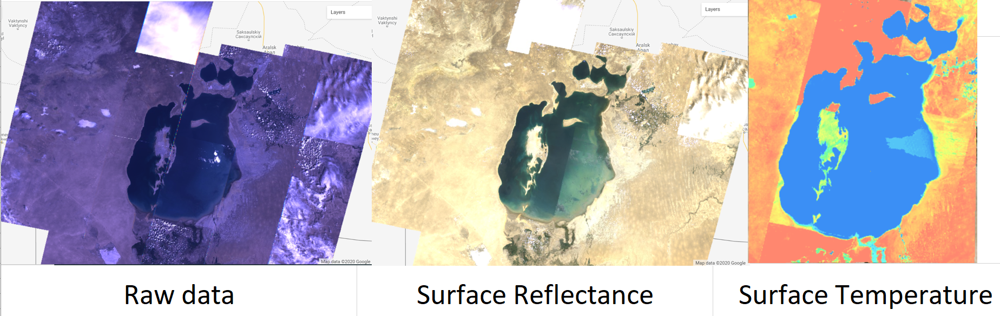
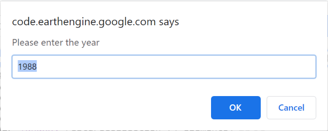
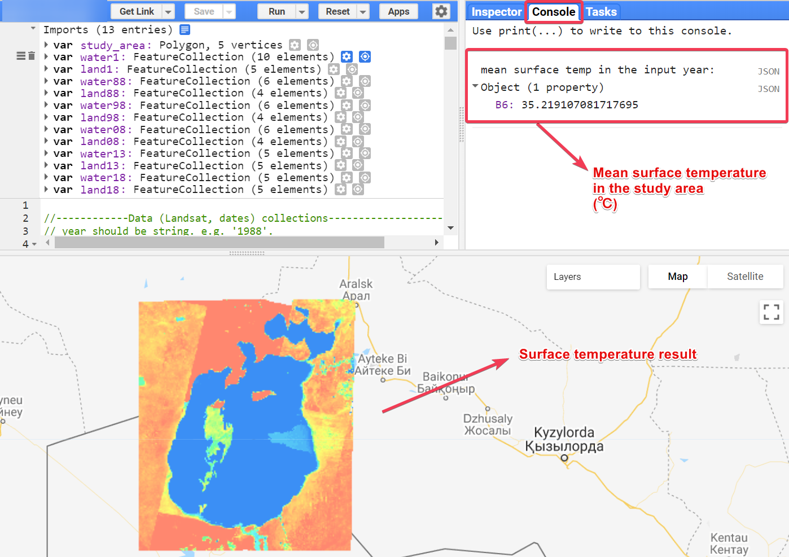

# SurfaceTemp_AralSea
This project aims to monitor time-series changes of the Aral Sea and its surrounding environment through surface temperature method between 1988 and 2018. It utilized and analyzed the Landsat data (open &amp; free imagery source) with Google Earth Engine (GEE) to observe the surface temperature changes. The GEE codes are available [here](https://github.com/DorothyZou/SurfaceTemp_AralSea/blob/master/surface_temp.js). You can also directly jump to the [manual](##Manual).
## Introduction
Study Area - Aral Sea:

Let's see the comparison among Landsat Raw data, surface reflectance and the analyzed result (surface temperature).

## Result
The surface temperature changes during 1988-2018:

More details - please go to [result images](https://github.com/DorothyZou/SurfaceTemp_AralSea/tree/master/result_img)

## Methodology & Process:

## Manual

When the prompt appears, please enter the year between 1988 and 2018. Click OK or press Enter.

The result will show up on the map as a layer as shown on the image below.

