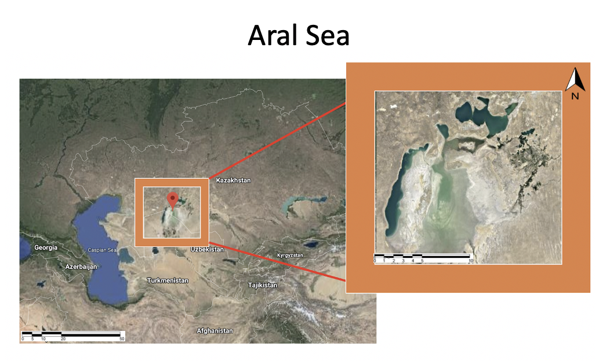
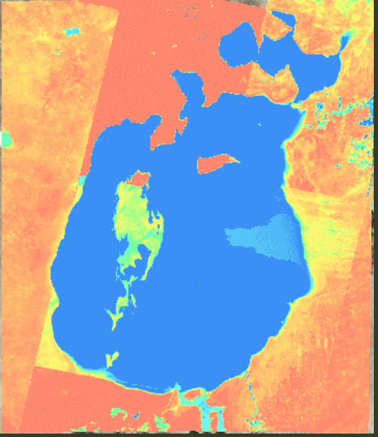
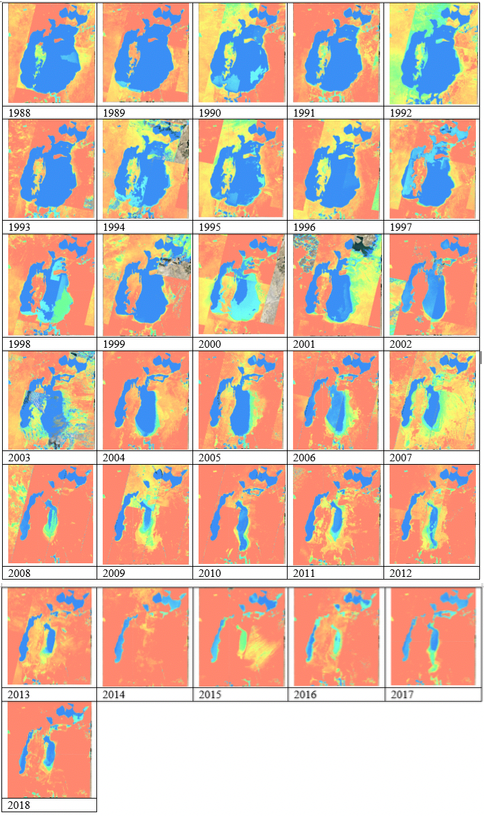
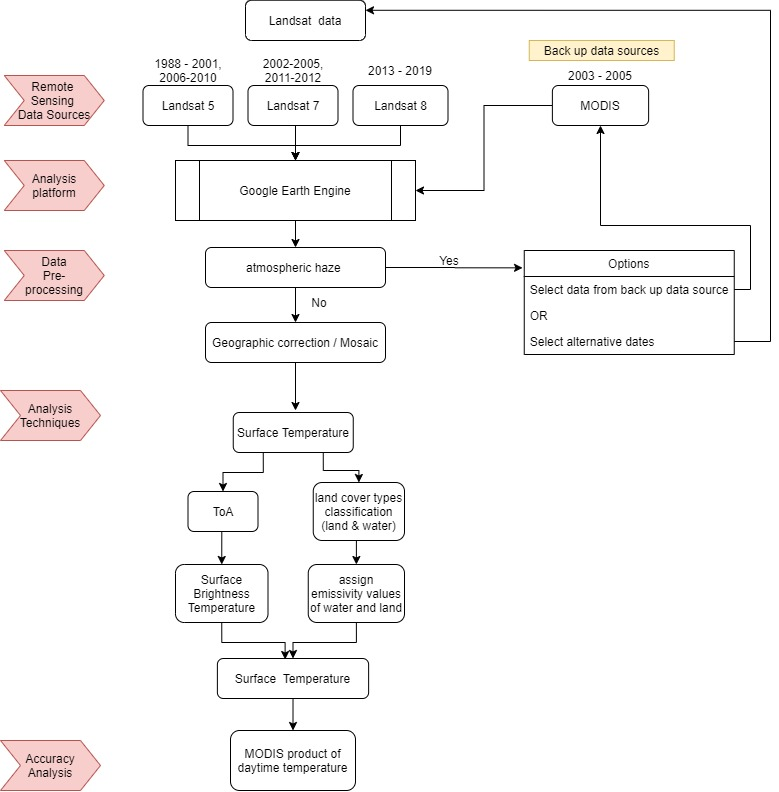

# SurfaceTemp_AralSea
This project aims to monitor time-series changes of the Aral Sea and its surrounding environment through surface temperature method between 1988 and 2018. It utilized and analyzed the Landsat data (open &amp; free imagery source) with Google Earth Engine (GEE) to observe the surface temperature changes. The GEE codes are available [here](https://github.com/DorothyZou/SurfaceTemp_AralSea/tree/master/result_img)

Study Area - Aral Sea:

The surface temperature changes during 1988-2018:

More details - please go to [result image](https://github.com/DorothyZou/SurfaceTemp_AralSea/tree/master/result_img)

Methodology & Process:

